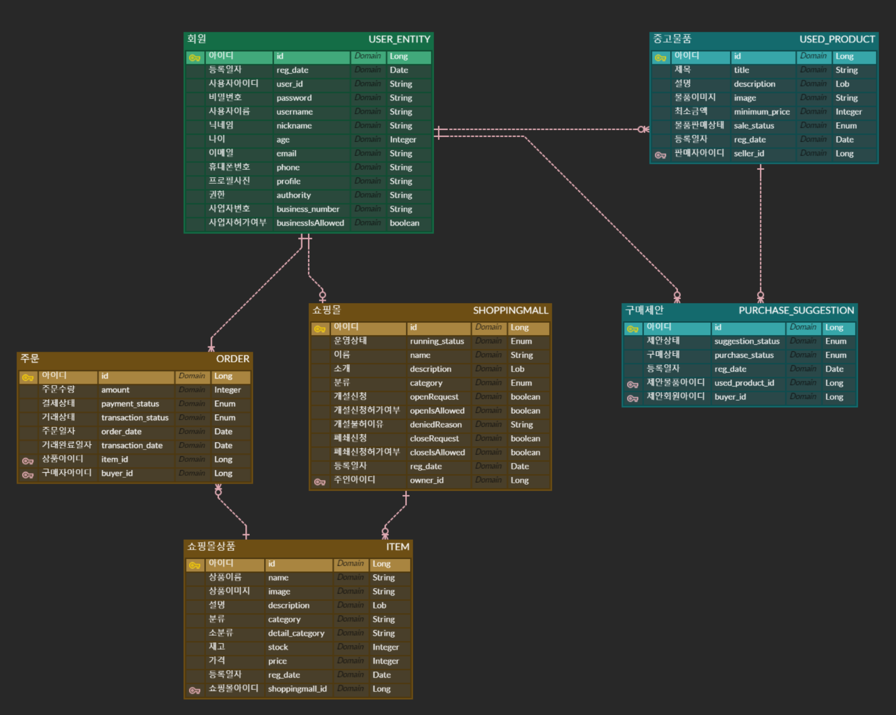

## 🌟 1. 프로젝트 개요 🌟
- 일반 사용자는 중고거래가 가능

- 사업자는 인터넷 쇼핑몰을 운영 가능.

- 프론트엔드 없이 백엔드만 개발. (포스트맨으로 테스트/ CORS는 고려X)

## 📋 2. 기능 설명 📋
**1) 기본 과제**
- 사용자 인증 및 권한 처리
- 중고거래 중개하기
- 쇼핑몰 운영하기

**2) 추가 과제 (최소 2개 구현)**
- 결제 시스템 (Toss payments)
- 사용자 위치기반 기능 (NCP maps)
- 알림 기능 추가하기 (Email - Jakarta Mail)
- 알림 기능 추가하기 (NCP SENS)
- 사용자 자동 로그인 방지 (NCP Capcha)

## 🚩 3. 나의 목표 🚩
**이번 프로젝트에서 놓치고 싶지 않은 것!!**

- 이제까지 배운 기술들을 명확히 **이해**하면서 코드를 작성할 것

- 어떠한 기술을 선택할 때 그 **이유**에 대해서 생각하고, 어떤 이유에서 선택했는지를 정리할 것

- **제약사항**을 반드시 지킬 것. 꼼수부리지 않기

- 유지보수, 작업 효율을 고려하며 **확장성**과 **유연성**을 가진 서비스를 만들 것

- **오류**를 많이 겪을 것. 겪었던 오류들을 반드시 정리해둘 것

- 빠르고 신속하게 만들기보다 여유롭고 **차근차근** 하나씩 완성해나갈 것

ERD
